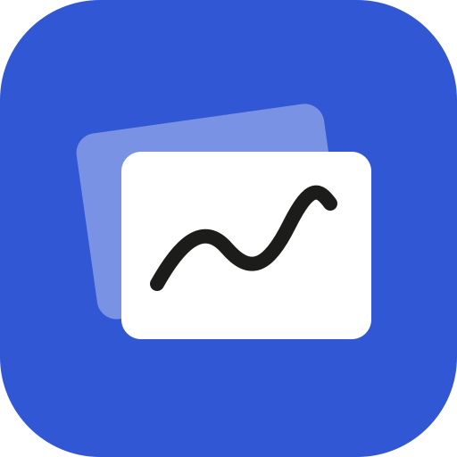
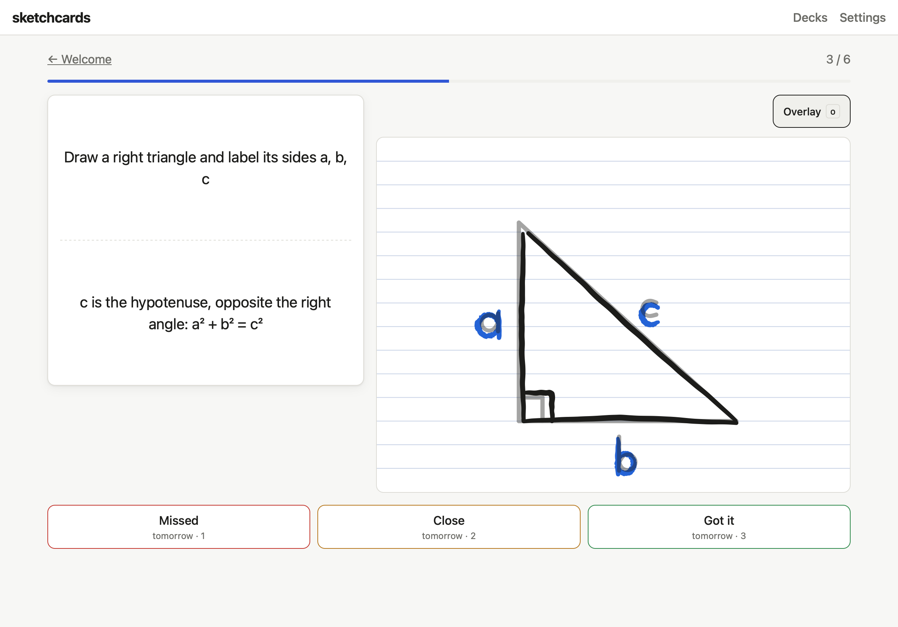
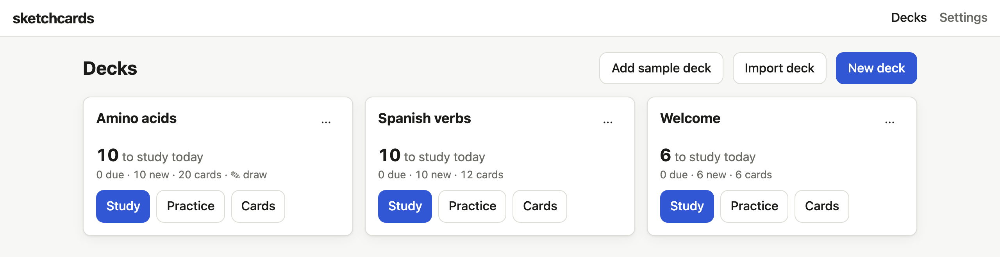
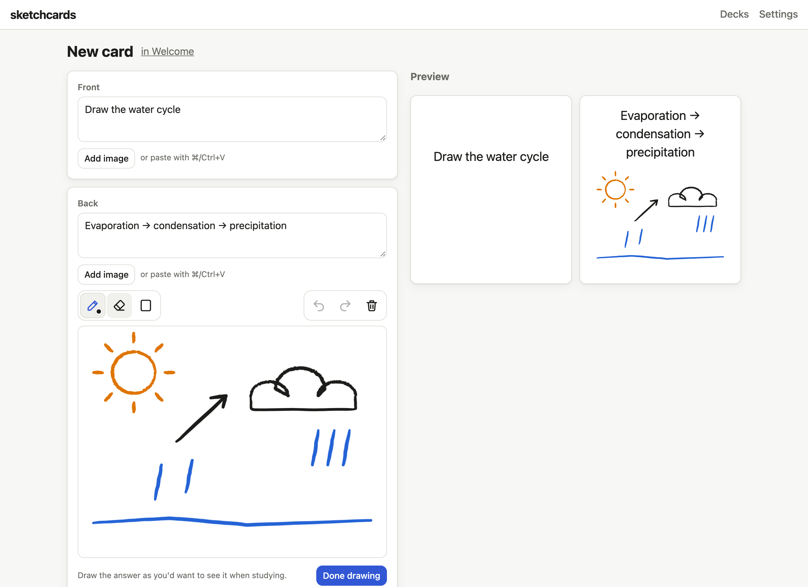
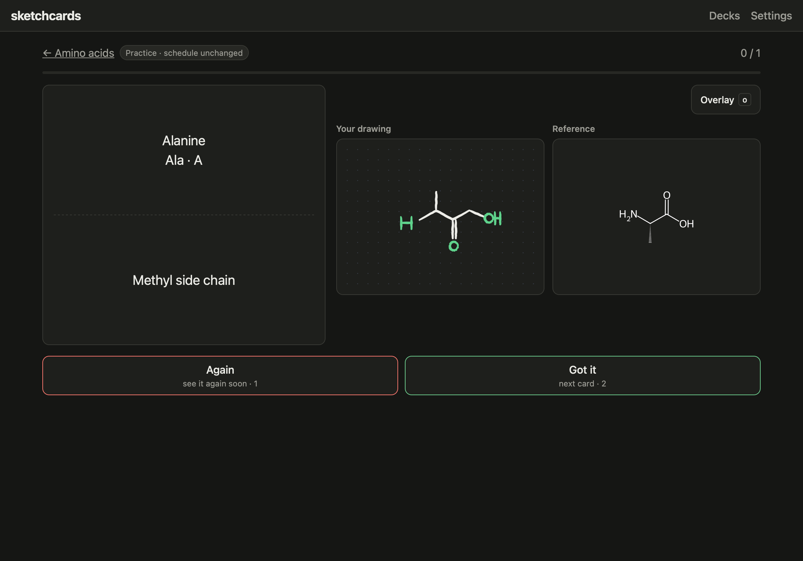
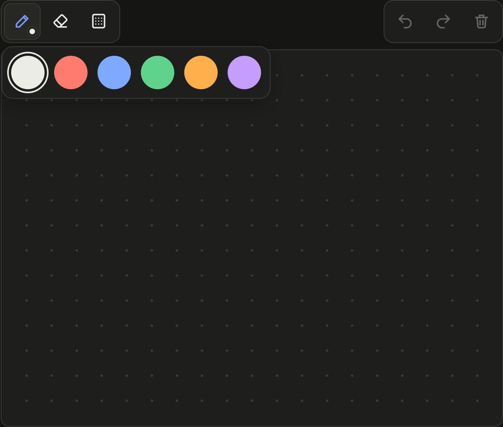

# sketchcards

**Flashcards you can draw.** 
Sketch the answer from memory, flip, and compare. Spaced repetition decides what's due.

### [Open the app →](https://sketchcards-mu.vercel.app)

<table>
  <tr>
    <td width="50%"> <b>Your decks, synced</b>: build on a laptop, study on an iPad.</td>
    <td width="50%"> <b>Sketch the answer</b> right on the card, in color.</td>
  </tr>
  <tr>
    <td width="50%"> <b>Draw, flip, compare</b>, side by side or overlaid. Light or dark.</td>
    <td width="50%"> <b>Made for Apple Pencil</b>: pressure, palm rejection, colors, paper.</td>
  </tr>
</table>

## Features

- ✏️ **Draw cards**: sketch from memory, then check against the answer
- 🔁 **Spaced repetition**: Missed / Close / Got it schedules each card
- 🎯 **Practice mode**: drill any deck without touching your schedule
- ☁️ **Syncs everywhere** and works offline
- 📲 **Installable**: add it to your iPad home screen
- 📥 **Import / export**: CSV, or full JSON decks with images and sketches

## Tips

- **iPad:** open the app in Safari → **Share → Add to Home Screen**, then sign in with Google.
- **Try a Draw deck:** import [`examples/amino-acids.json`](examples/amino-acids.json), which has the 20 amino acids with their structures (generated with RDKit; spot-check them against your textbook).
- **Shortcuts:** <kbd>Space</kbd> flips · <kbd>1</kbd> <kbd>2</kbd> <kbd>3</kbd> grade · <kbd>O</kbd> toggles the overlay

Built with React, Vite, TypeScript, Supabase and <a href="https://github.com/steveruizok/perfect-freehand">perfect-freehand</a> · <a href="LICENSE">MIT license</a>
