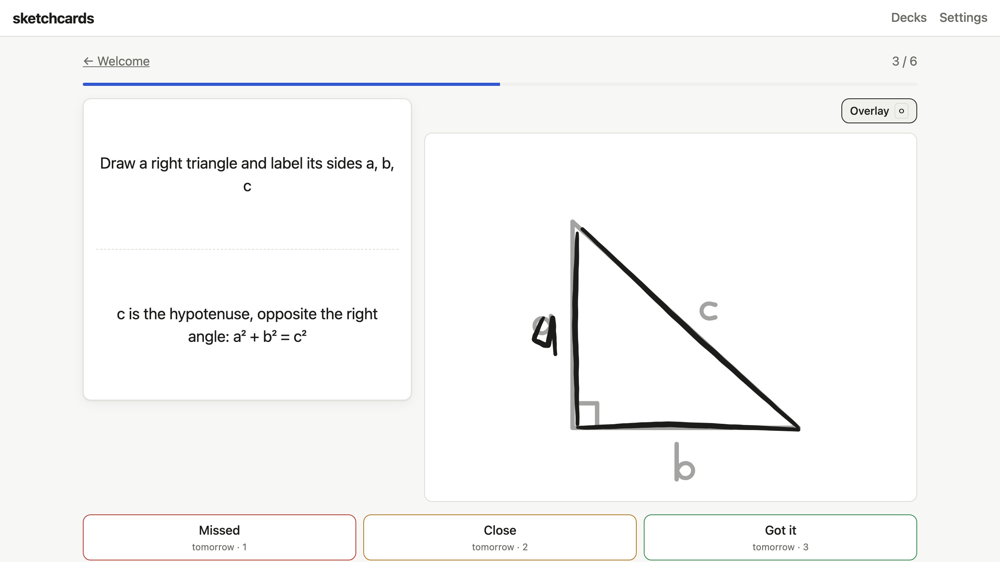

# sketchcards

A small, free-to-run flashcard app with a **draw-your-answer** mode.

Make your own decks. Cards are either classic **Flip** cards (read the front, flip, grade yourself) or **Draw** cards: a canvas sits next to the prompt, you sketch the answer from memory, flip, and see your drawing beside the correct answer (or overlaid on it). Spaced repetition decides what to review each day, and everything syncs between devices, so you can build decks on a laptop and study with an Apple Pencil on an iPad.



## Features

- **Decks and cards**: text and images on either side (upload, or paste with ⌘/Ctrl+V; images are resized and converted to WebP in the browser), tags, search, duplicate, move between decks.
- **Draw mode**: a pressure-sensitive canvas (Apple Pencil, finger, or mouse) with pen, eraser, undo/redo, and palm rejection. After flipping, compare side by side or toggle an overlay of the reference at 40% opacity. Your sketches are never saved.
- **Sketched answers**: "Draw on back" in the editor lets you sketch the reference answer itself. Sketches are stored as stroke data and rendered as SVG, so they stay tiny, sharp, and follow light/dark mode.
- **Spaced repetition** (SM-2 style): grade each card Missed / Close / Got it. Missed cards come back in the same session until you get them. Up to N new cards per day (default 10, adjustable per deck).
- **Sync and offline**: Supabase is the source of truth; a local IndexedDB copy makes the app open instantly and keeps working through brief offline periods (changes sync when you're back).
- **Import/export**: CSV import (`front,back,tags`) with a preview; JSON export/import per deck, including images and sketches; a full backup from Settings.
- **Installable PWA**: add it to your iPad home screen. Light and dark mode, keyboard shortcuts (Space to flip, 1/2/3 to grade, O for overlay).

## Tech stack

React + Vite + TypeScript, plain CSS · Supabase (Auth, Postgres, Storage) with Row Level Security · [`perfect-freehand`](https://github.com/steveruizok/perfect-freehand) for strokes · `vite-plugin-pwa` · Vitest · deployable as a static site (e.g. Vercel). No custom server.

## Self-hosting

You'll create **your own** Supabase project and use **your own** keys. Everything fits in the free tiers of Supabase and Vercel.

### 1. Create a Supabase project

1. Sign in at [supabase.com/dashboard](https://supabase.com/dashboard) and click **New project**.
2. Pick a name, generate a database password (save it somewhere), choose a region near you, keep the **Free** plan, and click **Create new project**.

### 2. Create the tables, policies, and storage bucket

1. In your project, open **SQL Editor** → **New query**.
2. Paste the contents of [`supabase/schema.sql`](supabase/schema.sql) and click **Run**.

This creates the `decks`, `cards`, and `progress` tables, enables Row Level Security on every table (each user can only read and write their own rows), and creates a private `card-images` storage bucket where each user can only access their own folder. It's safe to run again.

### 3. Configure sign-in

**Email (magic link)** is on by default.

1. Go to **Authentication → URL Configuration**.
2. Set **Site URL** to `http://localhost:5173` for now.
3. Under **Redirect URLs**, add `http://localhost:5173/**`. After deploying, add your production URL too (step 6).

**Google (optional)**

1. In the [Google Cloud console](https://console.cloud.google.com), create a project.
2. Open **Google Auth Platform** and click **Get started**. Enter an app name and support email, choose the **External** audience, and finish.
3. Go to **Clients → Create client**, choose **Web application**, and fill in:
   - **Authorized JavaScript origins**: `http://localhost:5173`, plus your production URL later.
   - **Authorized redirect URIs**: `https://<your-project-ref>.supabase.co/auth/v1/callback`.
4. Copy the Client ID and Client secret.
5. Under **Audience**, click **Publish app**, or add yourself as a test user.
6. In Supabase, go to **Authentication → Sign In / Providers → Google**. Enable it, paste the Client ID and secret, and click **Save**.

### 4. Add your keys

1. In Supabase, open **Project Settings → API Keys**.
2. Copy the **Project URL** and the **anon / publishable** key.
3. Create your local env file:

   ```sh
   cp .env.example .env.local
   ```

4. Fill in the two values:

   ```
   VITE_SUPABASE_URL=https://<your-project-ref>.supabase.co
   VITE_SUPABASE_ANON_KEY=<your anon or publishable key>
   ```

The anon/publishable key is meant to be public: it's bundled into the site, and Row Level Security is what protects the data. **Never use the `service_role` / secret key in this app** or commit it anywhere.

### 5. Run locally

Requires Node 20+.

```sh
npm install
npm run dev        # http://localhost:5173
npm test           # unit tests
npm run lint
npm run build      # production build in dist/
```

### 6. Deploy to Vercel

1. Push your copy of this repo to GitHub.
2. At [vercel.com/new](https://vercel.com/new), import the repo. Vercel detects Vite automatically.
3. Under **Environment Variables**, add `VITE_SUPABASE_URL` and `VITE_SUPABASE_ANON_KEY`, then click **Deploy**.
4. Add your Vercel URL (e.g. `https://your-app.vercel.app`) in two places:
   - Supabase: **Authentication → URL Configuration**. Set **Site URL** to it and add `https://your-app.vercel.app/**` under **Redirect URLs**.
   - Google: add it to **Authorized JavaScript origins**, if you use Google sign-in.

`vercel.json` already routes all app paths to `index.html`.

### 7. Keep a free Supabase project awake (optional)

Free Supabase projects pause after about a week without activity. The [`keep-alive`](.github/workflows/keep-alive.yml) workflow pings your project every 3 days.

To turn it on, add two repository secrets under **Settings → Secrets and variables → Actions**: `SUPABASE_URL` and `SUPABASE_ANON_KEY` (the same public values as above). Without them, the workflow skips itself. A paused project can also be resumed from the Supabase dashboard.

## Using it on an iPad

- Open your deployed site in Safari, tap **Share → Add to Home Screen**, and launch it from the home screen.
- **Sign in inside the home-screen app with Google** if you can. iPadOS keeps the home-screen app's storage separate from Safari's, and a magic link from Mail opens in Safari, which signs Safari in, not the app.
  - If you want email sign-in in the app, set up custom SMTP in Supabase. You can then use the templates in [`supabase/templates/`](supabase/templates/), which add a 6-digit code you can type into the app instead of tapping the link. Supabase's free tier only allows template edits with custom SMTP.
- Draw cards use the Apple Pencil's pressure. Once the Pencil touches the canvas, finger touches on it are ignored, so you can rest your palm.

## Importing cards

- **CSV**: open a deck → **Deck settings → Import CSV**. Use the columns `front,back,tags`; separate tags with `;`, and quote fields that contain commas or line breaks. You'll see a preview, with any problem rows listed, before anything is saved. CSV import creates text cards only.
- **JSON**: **Import deck** on the Decks page accepts files from **Export deck** or **Export backup** (Settings), which include images, sketches, and scheduling progress.
- **Sample deck**: **Add sample deck** creates a short Welcome deck that shows how flipping, grading, and drawing work.

### Example: an amino acid Draw deck

[`examples/amino-acids.json`](examples/amino-acids.json) is one example of a Draw deck. It has the 20 standard amino acids, with the name and 3-/1-letter codes on the front and the skeletal structure on the back. Import it with **Import deck**.

The structures were generated once with RDKit by [`scripts/generate_amino_acids.py`](scripts/generate_amino_acids.py). Python and RDKit are not needed to build or run the app. The structures are drawn in neutral (non-zwitterionic) form, as L-isomers. Spot-check them against your course materials before relying on them.

## Free-tier caveats

- **Supabase Free**:
  - 500 MB database and 1 GB file storage. Images are compressed to WebP of at most about 1200 px, so this goes a long way.
  - Projects pause after about a week of inactivity (see step 7).
  - The built-in email service sends only a few sign-in emails per hour. That's fine for personal use; use Google sign-in or custom SMTP for more.
- **Vercel Hobby** is for personal, non-commercial use.

## Project layout

```
src/
  data/        Supabase sync, IndexedDB cache, images (no UI)
  srs/         Scheduler, daily queue, session logic (pure, unit-tested)
  draw/        Stroke rendering and hit-testing
  io/          CSV, JSON deck format, import/export, sample deck
  components/  DrawPad canvas, card faces, dialogs
  pages/       Screens
supabase/      schema.sql (tables, RLS, storage), CLI config
examples/      Optional example decks
scripts/       One-off generators (not needed to run the app)
```

## License

[MIT](LICENSE)
